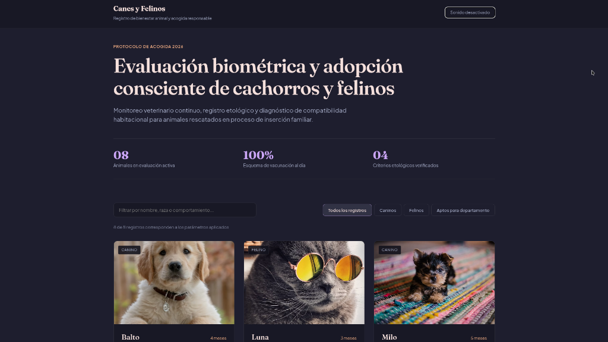

# Anti-Generic Web & Frontend Design Skill

Universal directives for eliminating AI clichés, formulaic layouts, repetitive marketing copy, and redundant code comments across web design, frontend engineering, and clean UI architecture.

---

## The Problem

Large Language Models (LLMs) share predictable defaults when generating frontend interfaces, web apps, components, and source code:
1. **Artificial Ornaments:** Brackets `[ ]` surrounding titles, double slashes `//` used as stylistic dividers, floating dots `·`, fake telemetry readouts (`LAT/LONG`, `SIGNAL: 98%`), and left border callout bars (`border-left`) placed beside every paragraph.
2. **Icon Spam & Cloned Cards:** Generic icons (rockets, gears, lightbulbs) placed in colored circles simply to fill space, alongside repetitive grids of white cards with exaggerated rounded corners (`rounded-3xl`) and fuzzy drop shadows.
3. **Trite Copywriting:** Formulaic marketing filler (*"Empowering the future of..."*, *"Revolutionizing the way you..."*, *"Unlock the power of..."*) and twin generic action buttons (*"Get Started / Learn More"*).
4. **Template Archetypes:** The ubiquitous three-column pricing grid with a glowing center card marked *"MOST POPULAR"*, infinite word marquees, and grayed-out fictional logo strips (*Acme Corp, Nova, Zenith*).
5. **Comment Bloat & Div-Soup:** Source code flooded with narrative descriptions of self-evident syntax (`// Set loading to true`), multi-line banner dividers (`// ====================`), emojis in comments, and inaccessible non-semantic markup.

---

## What This Skill Enforces

### Pillar 1: Prohibited Visual Sins (UI)
* ❌ **Zero brackets `[ ]`** on headings, categories, phase numbers, or badges.
* ❌ **Zero double slashes `//`** as decorative separators.
* ❌ **Zero decorative dashes `-` / `—`** framing text.
* ❌ **Zero floating dots, bullet points (`•`, `&bull;`), and circular status/indicator dots** beside buttons, tags, or pills (communicate state purely through typography, border contrast, or subtle tint).
* ❌ **Zero fake telemetry or cockpit styling** (`SIGNAL: 98%`, `LAT/LONG`).
* ❌ **Zero vertical accent bars** (`border-left` callout pattern) beside text.
* ❌ **Zero icon spam** as visual crutches in lists and grids.
* ❌ **Zero cartoonish rounded corners** (`rounded-3xl` on large rectangular containers).
* ❌ **Zero generic AI gradients** (purple-to-cyan) and fuzzy drop shadows.

### Pillar 2: Anti-Cliché Copywriting
* Bans hollow buzzword formulas (*"Empowering..."*, *"Revolutionizing..."*, *"Unlock..."*).
* Bans twin generic buttons (*"Get Started / Learn More"*).
* Requires concrete value in the first sentence, verifiable specifications, and descriptive action triggers (*"Browse collection"*, *"Download technical paper"*).

### Pillar 3: Editorial Structure & Layouts
* Bans cloned pricing grids, infinite word marquees, and fake logo strips.
* **Ultra-wide hero headlines (2 to 3 lines max):** Headings breathe in broad containers (`max-w-5xl` or greater) rather than wrapping into 5 or 6 cramped lines.
* **Generous vertical rhythm:** Sections treated as independent chapters (`py-24` to `py-40`).
* **Refined architectural surfaces:** Precise 1px hairline dividers, balanced asymmetry, and intentional tonal contrast.

### Pillar 4: Clean Code, Accessibility & Surgical Comments
* Zero narrative comments explaining obvious syntax (`// Return user`, `// Handle click`).
* Zero multi-line divider banners, ASCII frames, or decorative noise.
* Zero emojis or graphic symbols (`🚀`, `✨`, `⚡`, `➔`, `✦`) in comments.
* Zero generic mock placeholders (*"John Doe"*, *"Lorem ipsum"*).
* Zero phantom event handlers (`onClick={() => console.log('click')}`).
* Zero inaccessible div-soup: strict use of native semantic elements (`<button>`, `aria-label`, descriptive `alt` tags).
* **Single-line surgical comments:** Concise explanations strictly addressing the non-obvious "why".

## Universal Compatibility & Setup

This skill is 100% platform-agnostic. You can load or inject `SKILL.md` into any AI coding assistant, agentic workflow, or LLM system prompt to instantly enforce clean editorial UI and eliminate generic code habits.

### Prompt Any AI to Install It Directly
If you are interacting with any autonomous AI agent (Claude Code, Cursor, Codex, ChatGPT, Antigravity, etc.), paste this instruction:

> *"Please fetch and apply the rules from https://raw.githubusercontent.com/CANTARERO8/anti-generic-design/main/SKILL.md to ensure all frontend architecture, UI design, and code comments remain clean, editorial, accessible, and free of AI clichés."*

---

### One-Liner Quick Installs

#### Claude Code & Anthropic Claude
Append directly to your root `CLAUDE.md`:
```bash
curl -sSL https://raw.githubusercontent.com/CANTARERO8/anti-generic-design/main/SKILL.md >> CLAUDE.md
```

#### Cursor
Save into `.cursor/rules` as an active rule:
```bash
mkdir -p .cursor/rules && curl -sSL https://raw.githubusercontent.com/CANTARERO8/anti-generic-design/main/SKILL.md -o .cursor/rules/anti-generic.mdc
```

#### GitHub Copilot
Add to your project's Copilot instructions:
```bash
mkdir -p .github && curl -sSL https://raw.githubusercontent.com/CANTARERO8/anti-generic-design/main/SKILL.md -o .github/copilot-instructions.md
```

#### OpenAI Codex & ChatGPT Custom Instructions
Fetch or inject `SKILL.md` directly into your workspace or system instructions:
```bash
curl -sSL https://raw.githubusercontent.com/CANTARERO8/anti-generic-design/main/SKILL.md -o .codexrules
```

#### Windsurf (Codeium)
Add directly as workspace rules:
```bash
curl -sSL https://raw.githubusercontent.com/CANTARERO8/anti-generic-design/main/SKILL.md -o .windsurfrules
```

#### Aider, Continue.dev & Roo Code
- **Aider:** Run `aider --read https://raw.githubusercontent.com/CANTARERO8/anti-generic-design/main/SKILL.md` or add to `.aider.conf.yml`.
- **Continue.dev:** Add `https://raw.githubusercontent.com/CANTARERO8/anti-generic-design/main/SKILL.md` as context in `config.json`.
- **Roo Code / Cline:** Paste the raw URL or content into your custom prompt rules.

#### Google Antigravity
Clone directly into your global Antigravity skills directory:
```bash
git clone https://github.com/CANTARERO8/anti-generic-design.git ~/.gemini/config/skills/anti-generic-design
```
*Or install per-project inside your repository root:*
```bash
mkdir -p .agents/skills && git clone https://github.com/CANTARERO8/anti-generic-design.git .agents/skills/anti-generic-design
```

#### Any Other LLM / Autonomous Agent
Simply paste the raw content of `SKILL.md` into your initial system instructions.

---

## Comparison Demos

The repository includes two real-world examples generated from the exact same prompt to demonstrate the difference:

### 1. Default AI Output (Without Skill)
Common AI defaults: ambient glows, emoji badges, playful/toyish clichés, and card clutter.


### 2. Output with `anti-generic-design`
Editorial typography, dignified palette, architectural layout, clean metrics, zero cliché ornaments, and disciplined code.



- **[`demo/with-skill/`](demo/with-skill/)**: Live code with `anti-generic-design` enabled.
- **[`demo/without-skill/`](demo/without-skill/)**: Baseline code with default AI behavior.

---

## Repository Structure

```
.
├── SKILL.md            # Core skill instructions and pre-delivery checklist
├── README.md           # Documentation and installation guide
├── LICENSE             # MIT License (Eduardo Cordova)
├── assets/
│   └── img/            # Comparison screenshots
└── demo/
    ├── with-skill/     # Example generated with anti-generic-design
    │   ├── index.html
    │   ├── styles.css
    │   └── app.js
    └── without-skill/  # Baseline example generated with standard AI defaults
        ├── index.html
        ├── styles.css
        └── app.js
```

---

## Author & License

Created and authored by **Eduardo Cordova** ([@CANTARERO8](https://github.com/CANTARERO8)).

Released under the [MIT License](LICENSE).
